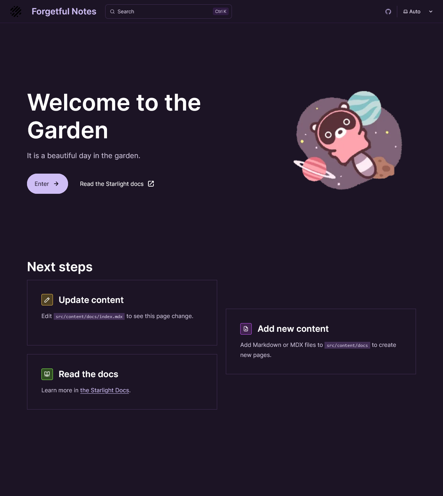

# Astro Garden

A [Starlight](https://starlight.astro.build) project powered by [Astro](https://astro.build). Uses [BrainDB](https://github.com/stereobooster/braindb) as content layer.

|  |  |
| --- | --- |

## 🚀 Project Structure

Inside of your Astro + Starlight project, you'll see the following folders and files:

```plaintext
.
├── public/
├── src/
│   ├── assets/
│   ├── components/
│   ├── content/
│   │   └── docs/
│   ├── lib/
│   │   └── braindb.mjs
│   ├── styles/
│   │   └── custom.css
│   └── content.config.ts
├── .gitignore
├── astro.config.mjs
├── package.json
└── tsconfig.json
```

Starlight looks for `.md` or `.mdx` files in the `src/content/docs/` directory. Each file is exposed as a route based on its file name.

Images can be added to `src/assets/` and embedded in Markdown with a relative link.

Static assets, like favicons, can be placed in the `public/` directory.

## 🔗 Features

### Backlinks

This digital garden includes automatic backlinks powered by BrainDB. When you link to other pages using wiki-style syntax `[[Page Name]]`, the linked page will automatically show a "Backlinks" section in its table of contents, displaying all pages that link to it.

**How it works:**

- Use `[[Page Name]]` syntax to create links between pages
- Backlinks automatically appear in the table of contents sidebar
- Only shows links from published pages (drafts are hidden in production)

**To disable backlinks on a specific page:**

```yaml
---
title: "Page Title"
backlinks: false
---
```

## 🧞 Commands

All commands are run from the root of the project, from a terminal:

| Command                | Action                                           |
| :--------------------- | :----------------------------------------------- |
| `pnpm install`         | Installs dependencies                            |
| `pnpm dev`             | Starts local dev server at `localhost:4321`      |
| `pnpm check`           | Run checks for broken links, missing images, etc. |
| `pnpm build`           | Build your production site to `./dist/`          |
| `pnpm preview`         | Preview your build locally, before deploying     |

## 👀 Want to learn more?

Check out [Starlight’s docs](https://starlight.astro.build/), read [the Astro documentation](https://docs.astro.build), or jump into the [Astro Discord server](https://astro.build/chat).
